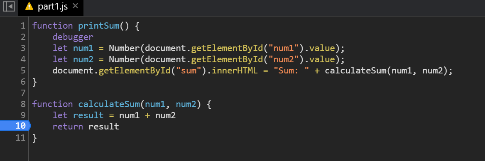

# Debugging
1. What was the bug?
`document.getElementById("num1/2").value` returns a string. Therefore, `num1` and `num2` were being concatenated, rather than added, in `calculateSum`.

2. How would you fix it? Include a screenshot of your fix.
I would fix the bug by converting the strings returned by `document.getElementById("num1/2").value` into numbers.
